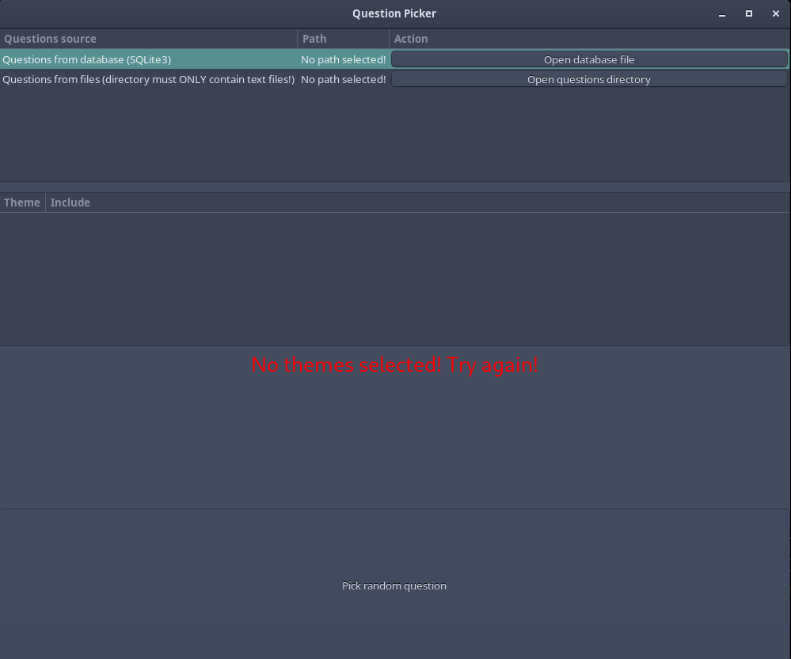
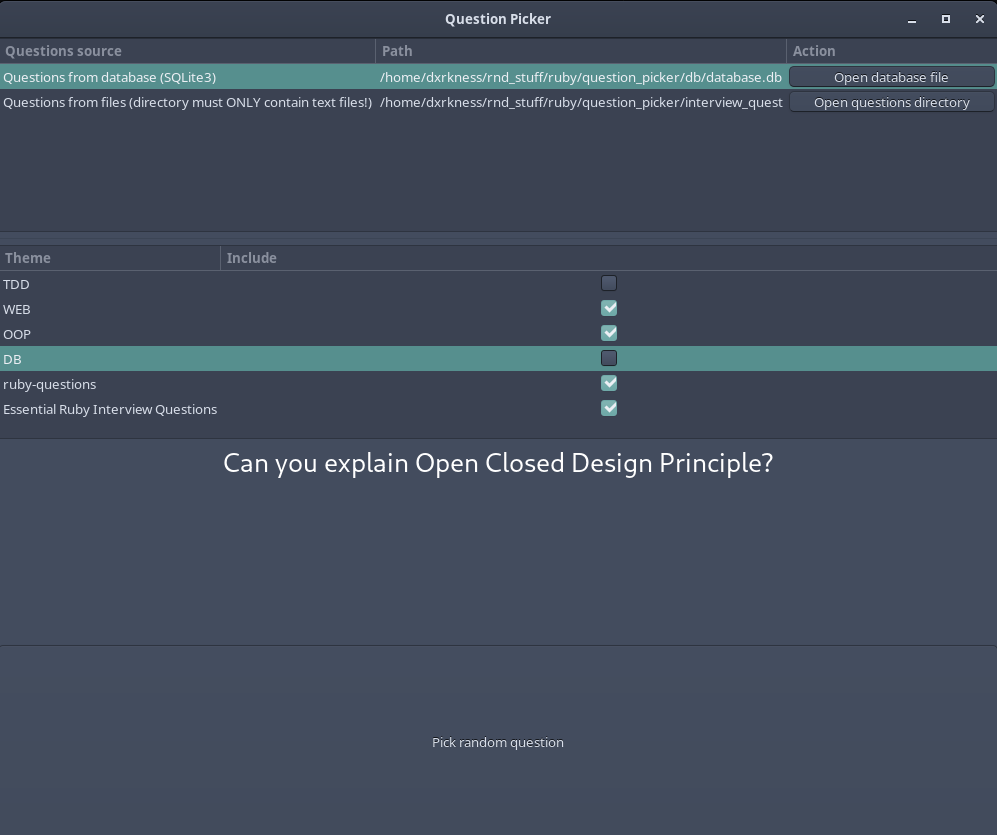

# Ruby "Question Picker"

## Description
Simple program that picks a random question once you press a button! 
The algorithm is simple:
1. Choose sources where to take questions from, either:
   * SQLite3 database

   or
   * Directory, that holds only .txt files
2. Choose themes
3. Press button and the random question is picked, voila!

## Screenshots

